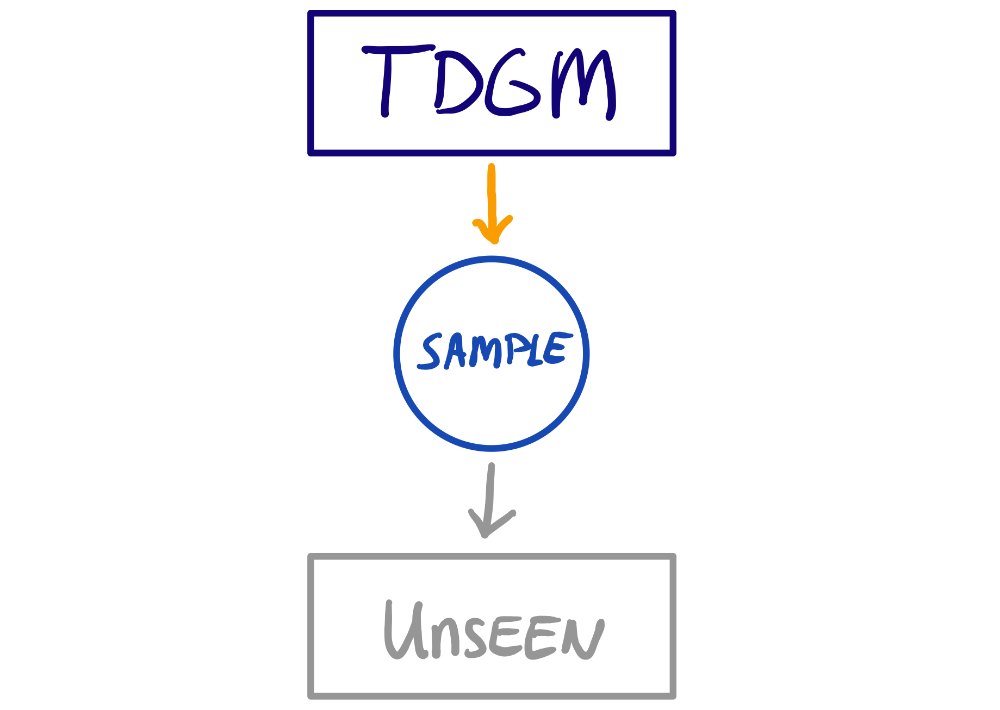

# Today 

## Course Materials

Everything for today (and more) can be found at

[www.gerkovink.com/rijkR](https://www.gerkovink.com/rijkR/)

## This lecture

- Pipes

- Data manipulation

- Basic analysis (correlation & t-test)

- Data visualization with `ggplot2`

**Two learning curves**: Practicals with and without answers

## Packages we use in these slides
```{r warning=FALSE, message=FALSE}
library(dplyr)      # data manipulation
library(magrittr)   # pipes
library(mice)       # for the boys data
library(ggplot2)    # visualization
library(DT)         # fancy JS/html tables
library(reshape2)   # melt stuff
```

## Opinion
<center>
{width=60%}
</center>

## The data
```{r}
head(boys)
```

## Goal

At the end of this lecture we aim to understand what happens in 

```{r eval = FALSE}
ggplot(mutate(na.omit(select(boys, age, hgt, reg)), height_meters = hgt/100), 
       aes(height_meters, age)) + geom_point(aes(group = reg))
```

# Pipes

## This is a pipe:

```{r message=FALSE, eval = FALSE}
boys %>% 
  select(is.numeric) %>% 
  cor(use = "pairwise.complete.obs") %>% 
  round(3)
```

It effectively replaces `round(cor(select(boys, is.numeric), use = "pairwise.complete.obs"), digits = 3)`.

</img>

## Why are pipes useful?
Benefit: a single object in memory that is easy to interpret
Your code becomes more readable:

- data operations are structured from left-to-right and not from in-to-out
- nested function calls are avoided
- local variables and copied objects are avoided
- easy to add steps in the sequence

## What do pipes do:

- `f(x)` becomes `x %>% f()`
```{r}
boys$age %>% mean()
```
- `f(x, y)` becomes `x %>% f(y)` 
```{r}
boys %>% head(n = 1)
```
- `h(g(f(x)))` becomes `x %>% f %>% g %>% h` 
```{r warning=FALSE}
boys %>% select(is.numeric) %>% na.omit() %>% colMeans
```

# More pipe stuff

## The standard `%>%` pipe
<center>
{width=60%}
</center>

## The `%$%` pipe
<center>
{width=60%}
</center>

## The role of `.` in a pipe
In `a %>% b(arg1, arg2, arg3)`, `a` will become `arg1`. With `.` we can change this.
```{r eval = FALSE}
boys %>%
  plot(bmi ~ age, data = .)
```
VS
```{r eval = FALSE}
boys %$%
  plot(bmi ~ age)
```
The `.` can be used as a placeholder in the pipe. 

# Data manipulation

## Performing a t-test in a pipe
```{r message=FALSE}
boys %>%
  mutate(ovwgt = bmi > 25) %$% 
  t.test(age ~ ovwgt)
```
is the same as 
```{r eval=FALSE}
t.test(age ~ (bmi > 25), data = boys)
```

## Melting
```{r}
boys %>% 
  select(reg, age) %>% 
  melt(id.vars = "reg", variable.name = "variable", value.name = "value") %>%
  datatable(options = list(pageLength = 25, scrollY = "250px"))
```

## Calculate statistics
```{r}
boys %>% 
  select(reg, age) %>% 
  melt(id.vars = "reg", variable.name = "variable", value.name = "value") %>%
  group_by(variable, reg) %>% 
  summarise_all(list(mean = mean, sd = sd), na.rm = TRUE) %>% 
  datatable(options = list(pageLength = 25, scrollY = "200px"))
```

## Multiple columns
```{r}
boys %>% 
  select(reg, where(is.numeric)) %>% 
  melt(id.vars = "reg", variable.name = "variable", value.name = "value") %>%
  group_by(variable, reg) %>% 
  summarise_all(list(mean = mean, sd = sd), na.rm = TRUE) %>% 
  datatable(options = list(pageLength = 25, scrollY = "200px"))
```

## Mutate: add
```{r}
boys %>% 
  mutate(bmi_calc = wgt / (hgt/100)^2) %>% 
  select(bmi, bmi_calc) %>% 
  head()
```

## Mutate: remove
```{r}
boys %>% 
  mutate(reg = NULL,
         gen = NULL, 
         phb = NULL) %>% 
  head()
```
## Mutate: change
```{r}
boys %>% 
  mutate(hgt = hgt/100) %>% 
  tail()
```
## Mutate: transform column
```{r}
boys %$% table(reg)

boys %>% 
  select(hgt, reg) %>%
  mutate(across(!hgt, as.numeric)) %$% 
  table(reg)
```


# Data visualization with `ggplot2`

## The `anscombe` data
```{r}
anscombe
```

## The same statistical properties
```{r}
anscombe %>% colMeans()
anscombe %>% cor() %>% round(digits = 3) %>% .[1:4, 5:8]
anscombe %>% var() %>% round(digits = 3) %>% .[1:4, 5:8]
```

##  Fitting a line {.smaller}
```{r message = FALSE, fig.height=3.5}
anscombe %>%
  ggplot(aes(y1, x1)) + 
  geom_point() + 
  geom_smooth(method = "lm")
```

## Why visualise?

- We can process a lot of information quickly with our eyes
- Plots give us information about
    - Distribution / shape
    - Irregularities
    - Assumptions
    - Intuitions
- Summary statistics, correlations, parameters, model tests, *p*-values do not tell the whole story

### ALWAYS plot your data!


## Why visualise?

</img>
<p style="text-align:center;font-style:italic;font-size:0.5em;">Source: Anscombe, F. J. (1973). "Graphs in Statistical Analysis". American Statistician. 27 (1): 17–21.</p>


## Why visualise?

</img>

## What is `ggplot2`?
Layered plotting based on the book **The Grammer of Graphics** by Leland Wilkinsons.

With `ggplot2` you

1. provide the _data_
2. define how to map variables to _aesthetics_
3. state which _geometric object_ to display
4. (optional) edit the overall _theme_ of the plot

`ggplot2` then takes care of the details

## An example: scatterplot

1: Provide the data
```{r, eval=FALSE}
mice::boys %>%
  ggplot()
```

2: map variable to aesthetics
```{r, eval=FALSE}
mice::boys %>%
  ggplot(aes(x = age, y = bmi))
```

3: state which geometric object to display
```{r, eval=FALSE}
mice::boys %>%
  ggplot(aes(x = age, y = bmi)) +
  geom_point()
```

## An example: scatterplot
```{r, echo=FALSE, fig.align='center'}
mice::boys %>%
  ggplot(aes(x = age, y = bmi)) +
  geom_point(na.rm = TRUE)
```

## Why this syntax?

Create the plot
```{r, fig.align='center', dev.args=list(bg="transparent"), warning=FALSE, message=FALSE}
gg <- 
  mice::boys %>%
  ggplot(aes(x = age, y = bmi)) +
  geom_point(col = "dark green")
```

Add another layer (smooth fit line)
```{r, warning=FALSE, message=FALSE, fig.align='center', dev.args=list(bg="transparent")}
gg <- gg + 
  geom_smooth(col = "dark blue")
```

Give it some labels and a nice look
```{r, fig.align='center', dev.args=list(bg="transparent")}
gg <- gg + 
  labs(x = "Age", y = "BMI", title = "BMI trend for boys") +
  theme_minimal()
```

## Why this syntax?
```{r, warning=FALSE, message=FALSE, fig.align='center', dev.args=list(bg="transparent")}
plot(gg)
```

## Why this syntax?
</img>

## Revisit the start
```{r eval = FALSE}
ggplot(mutate(na.omit(select(boys, age, hgt, reg)), height_meters = hgt/100), 
       aes(height_meters, age)) + geom_point(aes(group = reg))
```

Is the same as
```{r eval = FALSE}
boys %>% 
  select(age, hgt, reg) %>% # select features
  na.omit() %>% # remove missings. NAUGHTY!
  mutate(height_meters = hgt/100) %>% # transform height
  ggplot(aes(x = height_meters, y = age)) + # define plot aes
  geom_point(aes(group = reg)) # add geom
```


