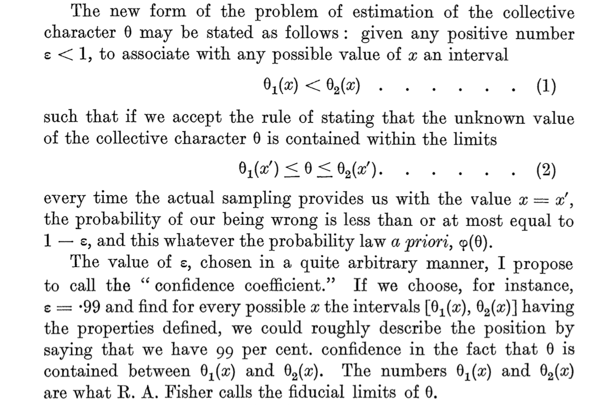

## This lecture

- the linear model

- assumptions

- model fit

- model complexity

- cross validation


##  We use the following packages
```{r message=FALSE}
library(MASS)
library(dplyr)
library(magrittr)
library(ggplot2)
library(mice)
library(DAAG)
library(caret)
```

# The linear model

## Notation
The mathematical formulation of the relationship between variables can be written as

\[
\mbox{observed}=\mbox{predicted}+\mbox{error}
\]

or (for the greek people) in notation as
\[y=\mu+\varepsilon\]

where

-  $\mu$ (mean) is the part of the outcome that is explained by model 
-  $\varepsilon$ (residual) is the part of outcome that is not explained by model 


## Univariate expectation
```{r, echo=FALSE, message=FALSE}
library(ggplot2)
set.seed(123)
plotdata <- data.frame(X = rnorm(100, 167.5, 10),
           Y = rnorm(100, 180.8, 10)) 
plotdata %>%
  ggplot(aes(X, Y)) + 
  geom_point(color = "blue") + 
  geom_point(aes(mean(X), mean(Y)), color = "orange", size = 5) + 
  geom_vline(xintercept = 168.4041, color = "orange") + 
  geom_hline(yintercept = 179.7245 , color = "orange") + 
  ggtitle(bquote("Bivariate normal")) + 
  theme_minimal()
```

## Conditional expectation
```{r echo=FALSE, message=FALSE, warning=FALSE}
fit <- plotdata %$%
  lm(Y~X)

plotdata %>%
  mutate(predicted = predict(fit),
          residuals = residuals(fit)) %>%
  ggplot(aes(X, Y)) +
  geom_smooth(method = "lm", se = FALSE, color = "orange") +
  geom_segment(aes(xend = X, yend = predicted), color = "orange", alpha = .5) +
  geom_point(aes(color = abs(residuals))) + 
  scale_color_continuous(low = "blue", high = "red") +  
  guides(color = FALSE) +  
  geom_point(aes(y = predicted), shape = 1, color = "orange") +
  ggtitle("Multivariate (X, Y)") + 
  theme_minimal()
```

# Assumptions

## The key assumptions
There are four key assumptions about the use of linear regression models. 

In short, we assume 

- The outcome to have a **linear relation** with the predictors and the predictor relations to be **additive**. 
  - the expected value for the outcome is a straight-line function of each predictor, given that the others are fixed. 
  - the slope of each line does not depend on the values of the other predictors
  - the effects of the predictors on the expected value are additive
  
  $$ y = \alpha + \beta_1X_1 + \beta_2X_2 + \beta_3X_3 + \epsilon$$

- The residuals are statistically **independent**
- The residual **variance is constant**
  - accross the expected values
  - across any of the predictors
- The residuals are **normally distributed** with mean $\mu_\epsilon = 0$

## A simple model
```{r cache = TRUE}
fit <- anscombe %$%
  lm(y1 ~ x1)
fit

fit2 <- anscombe %$%
  lm(y2 ~ x2)
```

## Visualizing the assumptions
```{r echo=FALSE}
par(mfrow = c(2, 2))
plot(fit)
```

## Visualizing the assumptions
```{r echo=FALSE}
par(mfrow = c(2, 2))
plot(fit2)
```

# Model fit

## A simple model
```{r cache = TRUE}
boys.fit <- 
  na.omit(boys) %$% # Extremely wasteful
  lm(age ~ reg)
boys.fit

boys %>% na.omit(boys) %$% aggregate(age, list(reg), mean)
```

## Plotting the model
```{r fig.height=3.5}
means <- boys %>% na.omit(boys) %>% group_by(reg) %>% summarise(age = mean(age))
ggplot(na.omit(boys), aes(x = reg, y = age)) + 
  geom_point(color = "grey") + 
  geom_point(data = means, stat = "identity", size = 3)
```


## Model parameters
```{r cache = TRUE}
boys.fit %>%
  summary()
```

## Scientific notation
If you have trouble reading scientific notation, `2e-16` means the following

$$2\text{e-16} = 2 \times 10^{-16} = 2 \times (\frac{1}{10})^{-16}$$

This indicates that the comma should be moved 16 places to the left:

$$2\text{e-16} = 0.0000000000000002$$

## Is it a good model? {.smaller}
```{r cache = TRUE}
boys.fit %>%
  anova()
```

It is not a very informative model. The `anova` is not significant, indicating that the contribution of the residuals is larger than the contribution of the model. 

The outcome `age` does not change significantly when `reg` is varied. 

## AIC
Akaike's *An Information Criterion* 
```{r cache = TRUE}
boys.fit %>% 
  AIC()
```

### What is AIC
AIC comes from information theory and can be used for model selection. The AIC quantifies the information that is lost by the statistical model, through the assumption that the data come from the same model. In other words: AIC measures the fit of the model to the data. 

- The better the fit, the less the loss in information
- AIC works on the log scale:
  - $\text{log}(0) = -\infty$, $\text{log}(1) = 0$, etc. 
- the closer the AIC is to $-\infty$, the better

# Model comparison

## A new model
Let's add predictor `hgt` to the model:
```{r cache = TRUE}
boys.fit2 <- 
  na.omit(boys) %$%
  lm(age ~ reg + hgt)

boys.fit %>% AIC()
boys.fit2 %>% AIC()
```

## Another model
Let's add `wgt` to the model
```{r cache = TRUE}
boys.fit3 <- 
  na.omit(boys) %$%
  lm(age ~ reg + hgt + wgt)
```

## And another model
Let's add `wgt` and the interaction between `wgt` and `hgt` to the model
```{r cache = TRUE}
boys.fit4 <- 
  na.omit(boys) %$%
  lm(age ~ reg + hgt * wgt)
```
is equivalent to 
```{r eval=FALSE}
boys.fit4 <- 
  na.omit(boys) %$%
  lm(age ~ reg + hgt + wgt + hgt:wgt)
```

## Model comparison
```{r cache = TRUE}
AIC(boys.fit, boys.fit2, boys.fit3, boys.fit4)
```

## And with `anova()`
```{r cache = TRUE}
anova(boys.fit, boys.fit2, boys.fit3, boys.fit4)
```

## Inspect `boys.fit3`
```{r cache = TRUE}
boys.fit3 %>% anova()
```

## Inspect `boys.fit4`
```{r cache = TRUE}
boys.fit4 %>% anova()
```
It seems that `reg` and the interaction `hgt:wgt` are redundant

## Remove `reg`
```{r}
boys.fit5 <- 
  na.omit(boys) %$%
  lm(age ~ hgt + wgt)
```
Let's revisit the comparison
```{r}
anova(boys.fit, boys.fit2, boys.fit3, boys.fit5)
```
The `boys.fit5` model is better than the previous model - it has fewer parameters

## Influence of cases
DfBeta calculates the change in coefficients depicted as deviation in SE's.
```{r cache = TRUE}
boys.fit5 %>%
  dfbeta() %>%
  head(n = 7)
```

# Prediction

## Fitted values
Let's use the simpler `anscombe` data example
```{r cache = TRUE}
fit <- anscombe %$% lm(y1 ~ x1)

y_hat <- 
  fit %>%
  fitted.values()
```
The residual is then calculated as
```{r cache = TRUE}
y_hat - anscombe$y1
```

## Predict new values
If we introduce new values for the predictor `x1`, we can generate predicted values from the model
```{r cache = TRUE, warning=FALSE}
new.x1 <- data.frame(x1 = 1:20)
fit %>% predict(newdata = new.x1)
```

## Predictions are draws from the regression line
```{r}
pred <- fit %>% predict(newdata = new.x1)
lm(pred ~ new.x1$x1)$coefficients
fit$coefficients
```

## Prediction intervals
```{r warning=FALSE}
fit %>% predict(interval = "prediction")
```

A prediction interval reflects the uncertainty around a single value. The confidence interval 
reflects the uncertainty around the mean prediction values. 

# Assessing predictive accuracy

## Model performance
```{r}
fit %>% 
  predict() %>% 
  caret::postResample(anscombe$y1)
```
These performance measures only give us estimates about the training error. 
<br><br>
Always use at least crossvalidation to evaluate predictive performance. 

## K-fold cross-validation

- Divide sample in $k$ mutually exclusive training sets
- Do for all $j\in\{1,\dots,k\}$ training sets
  
    1. fit model to training set $j$
    2. obtain predictions for test set $j$  (remaining cases)
    3. compute residual variance (MSE) for test set $j$
  
- Compare MSE in cross-validation with MSE in sample
- Small difference suggests good predictive accuracy

## The original model
```{r}
fit %>% summary()
```

## K-fold cross-validation `anscombe` data {.smaller}
```{r echo=T, fig.height=3.5, dev.args = list(bg = 'transparent')}
DAAG::CVlm(anscombe, fit, plotit=F, printit=T)
```

## K-fold cross-validation `anscombe` data {.smaller}

  -  residual variance sample is $1.24^2 \approx 1.53$
  -  residual variance cross-validation is 2.04 
  -  regression lines in the 3 folds are similar

```{r echo=F, fig.height=4, dev.args = list(bg = 'transparent')}
par(mar=c(5,4,4,2)+.1,cex=.8,cex.lab=1.5,cex.axis=1.2,cex.main=1.5)
```
```{r echo=T, fig.height=3.5, dev.args = list(bg = 'transparent')}
DAAG::CVlm(anscombe, fit, plotit="Observed", printit=F)
```

## Plotting the residuals
```{r echo=T, fig.height=3.5, dev.args = list(bg = 'transparent')}
DAAG::CVlm(anscombe, fit, plotit="Residual", printit=F)
```

## K-fold cross-validation `boys` data {.smaller}

  -  residual variance sample is 1
  -  residual variance cross-validation is 1.46
  -  regression lines in the 3 folds almost identical

```{r echo=F, fig.height=4, dev.args = list(bg = 'transparent')}
par(mar=c(5,4,4,2)+.1,cex=.8,cex.lab=1.5,cex.axis=1.2,cex.main=1.5)
```
```{r echo=T, fig.height=3.5, dev.args = list(bg = 'transparent'), warning=FALSE}
DAAG::CVlm(na.omit(boys), boys.fit5, plotit="Observed", printit=F)
```

## Plotting the residuals
```{r echo=T, fig.height=3.5, dev.args = list(bg = 'transparent'), warning=FALSE}
DAAG::CVlm(na.omit(boys), boys.fit5, plotit="Residual", printit=F)
```

## How many cases are used?
```{r}
na.omit(boys) %$%
  lm(age ~ reg + hgt * wgt) %>%
  nobs()
```

If we would not have used `na.omit()`
```{r}
boys %$%
  lm(age ~ reg + hgt * wgt) %>%
  nobs()
```

# Confidence intervals?

## 95\% confidence interval {.smaller}
*If an infinite number of samples were drawn and CI's computed, then the true population mean $\mu$ would be in* ***at least*** *95\% of these intervals*

\[
95\%~CI=\bar{x}\pm{t}_{(1-\alpha/2)}\cdot SEM
\]

Example
```{r}
x.bar <- 7.6 # sample mean
SEM   <- 2.1 # standard error of the mean
n     <- 11 # sample size
df    <- n-1 # degrees of freedom
alpha <- .15 # significance level
t.crit <- qt(1 - alpha / 2, df) # t(1 - alpha / 2) for df = 10
c(x.bar - t.crit * SEM, x.bar + t.crit * SEM) 
```

## {.smaller}
<center>

</center>

        Neyman, J. (1934). On the Two Different Aspects of the Representative Method: 
        The Method of Stratified Sampling and the Method of Purposive Selection. 
        Journal of the Royal Statistical Society, Vol. 97, No. 4 (1934), pp. 558-625

## Misconceptions {.smaller}
Confidence intervals are frequently misunderstood, even well-established researchers sometimes misinterpret them. .

1. A realised 95% CI does not mean:

- that there is a 95% probability the population parameter lies within the interval
- that there is a 95% probability that the interval covers the population parameter

    Once an experiment is done and an interval is calculated, the interval either covers, or does       not cover the parameter value. Probability is no longer involved. 

    The 95% probability only has to do with the estimation procedure. 

2. A 95% confidence interval does not mean that 95% of the sample data lie within the interval.
3. A confidence interval is not a range of plausible values for the sample mean, though it may be understood as an estimate of plausible values for the population parameter.
4. A particular confidence interval of 95% calculated from an experiment does not mean that there is a 95% probability of a sample mean from a repeat of the experiment falling within this interval.

## Confidence intervals
```{r fig.height = 4, echo=FALSE, message=FALSE, message=FALSE, warning = FALSE}
set.seed(1234)
library(plyr)
samples <- rlply(100, rnorm(5000, mean = 0, sd = 1))
info <- function(x){ 
  M <- mean(x)
  DF <- length(x) - 1
  SE <- 1 / sqrt(length(x))
  INT <- qt(.975, DF) * SE
  return(c(M, M - 0, SE, M - INT, M + INT))
}
format <- c("Mean" = 0, "Bias" = 0, "Std.Err" = 0, "Lower" = 0, "Upper" = 0)
require("magrittr")
results <- samples %>%
  vapply(., info, format) %>%
  t()
results <- results %>%
  as.data.frame() %>%
  mutate(Covered = Lower < 0 & 0 < Upper)
require(ggplot2)
limits <- aes(ymax = results$Upper, ymin = results$Lower)
ggplot(results, aes(y=Mean, x=1:100, colour = Covered)) + 
  geom_hline(aes(yintercept = 0), color = "dark grey", size = 2) + 
  geom_pointrange(limits) + 
  xlab("Simulations 1-100") +
  ylab("Means and 95% Confidence Intervals")
```

100 simulated samples from a population with $\mu = 0$ and $\sigma^2=1$. Out of 100 samples, only 5 samples have confidence intervals that do not cover the population mean.

## For fun
<center> 
{width=40%}
<br>[source](https://www.reddit.com/r/ProgrammerHumor/comments/8za9b6/hello_i_am_your_server_for_today/)
</center>

